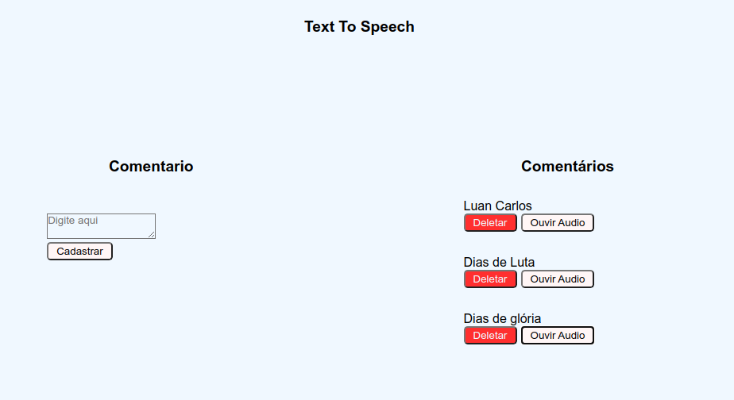

# TTS-Watson

Software responsável por converter textos em áudios e reproduzi-los

## Interface
<p align="center">
  
</p>

No lado esquerdo encontramos a funcionalidade para gerar os áudios, é importante informar que esta funcionalidade possui um pequeno delay, logo não se preocupe caso não gere imediatamente. <br>
No lado direito temos a funcionalidade para ouvir ou deleter os áudios gerados. <br>

## Tecnologias utilizadas
<ul>
<li>Nodejs</li>
<li>Express</li>
<li>Sequelize</li>
<li>MySQL</li>
<li>Mochas (testes)</li>
<li>ReactJS</li>
<li>Axios</li>
</ul>

## Instruções para executar o projeto
### 1) Clone o projeto em uma pasta.
`git clone https://github.com/LuanBMartins/TTS-Watson.git`
### 2) Entre na pasta raiz do projeto.
`cd TTS-Watson`
### 3) Instale as depend&ecirc;ncias de cliente e servidor.
#### Servidor (Server)
Estando na pasta raiz, realize os seguintes passos: <br>
1° `cd Server` <br>
2° `npm i` <br>
Termine de configurar criando um arquivo .env ainda neste diretório do projeto e edite com as seguintes informações:
```
APIKEY="SuaChaveTTSWatsonDaIBM"
APIURL="URLTTSWatsonDaIBM"
DATABASE=BaseDeDados
DB_USER=Usuário
DB_PASS=Senha
```

```diff
- Obs: É necessário já ter o MySQL configurado e uma base de dados definida, não se preocupe com a criação da tabela. <br>
! Em caso de dúvidas sobre MySQL, acesse: https://www.mysql.com/
```

INICIE O SERVIDOR: `npm start`
#### Cliente (client)
Abra um novo terminal e mantenha o anterior ativado. <br>
Estando na pasta raiz, realize os seguintes passos: <br>
1° `cd client` <br>
2° `npm i` <br>
Alguns avisos de dependencias desatualizadas podem acontecer! <br>
INICIE O CLIENTE: `npm start` <br>

```diff
- Obs: Por motivos de o servidor já estar rodando na porta 3000 o React irá sugerir rodar em outra porta, basta aceitar "y" e a interface será aberta no navegador.
```


<br><br>
Em casos de dúvidas, envie email para: carlosbm.luan@gmail.com